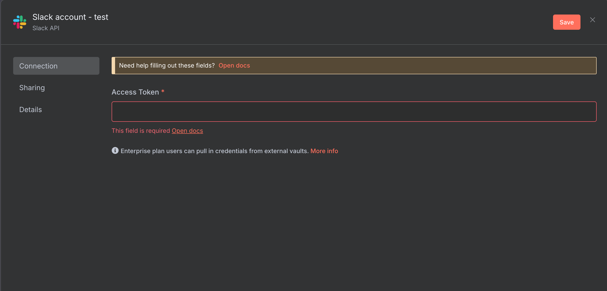

<!-- タイトルスライド -->

# n8n AI Agent

## Slack App & Advanced AI エージェント開発

<!-- _class: title-slide -->

---

# 目次

## 今日学ぶ内容

  <ol>
    <li><strong>AI AgentのインターフェースとしてのSlack App</strong> - Slack APIとOAuth</li>
    <li><strong>Advanced AI Agent</strong> - エージェントの内部構成とワークフロー</li>
    <li><strong>LangChainベースのn8n AIノード</strong> - 高度なAI機能の実装</li>
    <li><strong>Tips</strong> - 実践で役立つテクニック</li>
  </ol>

---

# 1. AI Agent のインターフェースとしての Slack App

## 1.1 Slack App の紹介

  <h3>🤖 AI Agent × Slack の力</h3>
  
  

    

      <h4>なぜSlack Appなのか</h4>
      <ul>
        <li><strong>日常のワークフロー</strong> - チームが既に使用している環境</li>
        <li><strong>リアルタイム対話</strong> - 即座の応答とフィードバック</li>
        <li><strong>コンテキスト共有</strong> - チャンネル内での知識共有</li>
        <li><strong>統合の容易さ</strong> - 他のツールとの連携が簡単</li>
        <li><strong>通知とアラート</strong> - 重要な情報の即座の配信</li>
      </ul>
    

    

      <h4>AI Agent機能の例</h4>
      <ul>
        <li><strong>質問応答</strong> - 専門知識の即座の提供</li>
        <li><strong>文書要約</strong> - 長文資料の自動要約</li>
        <li><strong>タスク管理</strong> - 作業の自動化と追跡</li>
        <li><strong>データ分析</strong> - レポートの自動生成</li>
        <li><strong>ワークフロー実行</strong> - 複雑な業務プロセスの自動化</li>
      </ul>
    

  

---

## 1.2 Slack API

  <h3>🔌 Slack API の基本構成</h3>
  
  

    

      <h4 style="color: var(--rp-iris);">📡 Web API</h4>
      <ul style="font-size: 0.9em;">
        <li><strong>REST API</strong> - HTTPベースの操作</li>
        <li><strong>メッセージ送信</strong> - chat.postMessage</li>
        <li><strong>ファイルアップロード</strong> - files.upload</li>
        <li><strong>ユーザー情報取得</strong> - users.info</li>
        <li><strong>チャンネル管理</strong> - channels.create</li>
      </ul>
    

    

      <h4 style="color: var(--rp-foam);">⚡ Events API</h4>
      <ul style="font-size: 0.9em;">
        <li><strong>リアルタイム通知</strong> - イベント駆動</li>
        <li><strong>メッセージイベント</strong> - message</li>
        <li><strong>メンションイベント</strong> - app_mention</li>
        <li><strong>チャンネルイベント</strong> - channel_created</li>
        <li><strong>ユーザーイベント</strong> - user_change</li>
      </ul>
    

    

      <h4 style="color: var(--rp-gold);">🎮 Interactive</h4>
      <ul style="font-size: 0.9em;">
        <li><strong>Block Kit</strong> - リッチなUI要素</li>
        <li><strong>ボタン</strong> - button</li>
        <li><strong>セレクトメニュー</strong> - select</li>
        <li><strong>モーダル</strong> - modal</li>
        <li><strong>ショートカット</strong> - shortcuts</li>
      </ul>
    

  

---

  <h3>📊 主要なAPI エンドポイント</h3>
  
  

    <table style="width: 100%;">
      <thead>
        <tr>
          <th>カテゴリ</th>
          <th>メソッド</th>
          <th>用途</th>
          <th>レスポンス例</th>
        </tr>
      </thead>
      <tbody>
        <tr>
          <td><strong>メッセージ</strong></td>
          <td>chat.postMessage</td>
          <td>メッセージ送信</td>
          <td>{"ok": true, "ts": "1234567890.123456"}</td>
        </tr>
        <tr>
          <td><strong>ユーザー</strong></td>
          <td>users.info</td>
          <td>ユーザー情報取得</td>
          <td>{"ok": true, "user": {"id": "U123", "name": "john"}}</td>
        </tr>
        <tr>
          <td><strong>チャンネル</strong></td>
          <td>conversations.list</td>
          <td>チャンネル一覧</td>
          <td>{"ok": true, "channels": [...]}</td>
        </tr>
        <tr>
          <td><strong>ファイル</strong></td>
          <td>files.upload</td>
          <td>ファイルアップロード</td>
          <td>{"ok": true, "file": {"id": "F123"}}</td>
        </tr>
      </tbody>
    </table>
  

---

## 1.3 Slack OAuth & Permissions

  <h3>🔐 OAuth 2.0 認証フロー</h3>
  
  

    

      <h4>OAuth設定手順</h4>
      <ol>
        <li><strong>Slack App作成</strong> - api.slack.com でアプリ登録</li>
        <li><strong>OAuth設定</strong> - スコープ設定</li>
        <li><strong>インストール</strong> - ワークスペースへのアプリインストール</li>
        <li><strong>トークン取得</strong> - アクセストークンの取得と保存</li>
        <li><strong>権限確認</strong> - 必要な権限の検証</li>
      </ol>
    

    

      <h4>重要なOAuth スコープ</h4>
      <ul>
        <li><strong>app_mentions:read</strong> - メンション通知の受信</li>
        <li><strong>chat:write</strong> - メッセージ送信権限</li>
        <li><strong>channels:read</strong> - チャンネル情報読み取り</li>
        <li><strong>files:write</strong> - ファイルアップロード権限</li>
        <li><strong>users:read</strong> - ユーザー情報読み取り</li>
      </ul>
    

  

---

  <h3>🔑 Slack Credential 設定</h3>
  <h4>Slack Appを作成後にn8nでCredential登録</h4>
  

    

      
    

    

      
    

  

  

---

  <h3>⚙️ 権限管理のベストプラクティス</h3>
  
  

    

      <h4 style="color: var(--rp-iris);">🎯 最小権限の原則</h4>
      <ul style="font-size: 0.9em;">
        <li>必要最小限のスコープのみ要求</li>
        <li>段階的な権限拡張</li>
        <li>定期的な権限見直し</li>
        <li>不要になった権限の削除</li>
      </ul>
    

    

      <h4 style="color: var(--rp-foam);">🔒 セキュリティ対策</h4>
      <ul style="font-size: 0.9em;">
        <li>トークンの暗号化保存</li>
        <li>HTTPSの強制使用</li>
        <li>トークンの定期的な更新</li>
        <li>アクセスログの監視</li>
      </ul>
    

    

      <h4 style="color: var(--rp-gold);">📊 監査とコンプライアンス</h4>
      <ul style="font-size: 0.9em;">
        <li>API使用状況の記録</li>
        <li>権限変更の追跡</li>
        <li>セキュリティイベントの監視</li>
        <li>規制要件への準拠</li>
      </ul>
    

  

---

## 1.4 Slack Event Subscriptions

  <h3>📡 Event Subscriptions の仕組み</h3>
  
  

    

      <h4>イベント駆動アーキテクチャ</h4>
      <ul>
        <li><strong>Webhook URL</strong> - n8nのSlackトリガー</li>
        <li><strong>イベントフィルタ</strong> - 必要なイベントのみ受信</li>
        <li><strong>リアルタイム処理</strong> - 即座のレスポンス</li>
        <li><strong>非同期処理</strong> - スケーラブルな設計</li>
        <li><strong>エラーハンドリング</strong> - 失敗時の再試行</li>
      </ul>
    

    

      <h4>主要なイベントタイプ</h4>
      <ul>
        <li><strong>app_mention</strong> - アプリへのメンション</li>
        <li><strong>message.channels</strong> - チャンネルメッセージ</li>
        <li><strong>reaction_added</strong> - リアクション追加</li>
        <li><strong>file_shared</strong> - ファイル共有</li>
        <li><strong>channel_created</strong> - チャンネル作成</li>
      </ul>
    

  

---

  <h3>🔧 イベント処理の実装例 (n8n)</h3>

  

    

      
    

    

      <h4>Slack API での設定</h4>
      <ul>
        <li><strong>Webhook URLs</strong> - Test URLとProduction URL</li>
        <li><strong>Credential</strong> - SlackのCredentialを指定</li>
        <li><strong>Trigger On</strong> - Bot / App Mention</li>
      </ul>
      

    <strong>重要:</strong> 検証ではTest URLを、ワークフローリリース後はProduction URLを利用します。
      

    

  

---

  <h3>🔧 イベント処理の実装例 (Slack API)</h3>

  

    

      
    

    

      <h4>Slack API での設定</h4>
      <ul>
        <li><strong>Enable Events</strong> - Onに</li>
        <li><strong>Request URL</strong> - n8nのWebhook URL</li>
        <li><strong>Subscrive to bot events</strong> - app_mention</li>
      </ul>
      

    <strong>重要:</strong> Event Subscriptions を使用する場合、n8nのWebhookノードでSlackからのイベントを受信し、
    適切なイベントタイプでフィルタリングして処理することが重要です。
      

    

  

---

## 1.5 Slack App を作ってみよう

  <h3>🛠️ 実践：AI Agent Slack App の構築</h3>
  
  

    

      <h4>Step 1: Slack App 作成</h4>
      <ol style="font-size: 0.9em;">
        <li><strong>api.slack.com</strong> にアクセス</li>
        <li><strong>"Create New App"</strong> → <strong>"From scratch"</strong></li>
        <li><strong>App Name:</strong> "AI Agent Bot"</li>
        <li><strong>Workspace:</strong> 開発用ワークスペース選択</li>
        <li><strong>"Create App"</strong> をクリック</li>
      </ol>
    

    

      <h4>Step 2: 基本設定</h4>
      <ol style="font-size: 0.9em;">
        <li><strong>OAuth & Permissions</strong> でスコープ設定</li>
        <li><strong>Event Subscriptions</strong> を有効化</li>
        <li><strong>Request URL:</strong> n8nのWebhook URL</li>
        <li><strong>Subscribe to events:</strong> app_mention, message.channels</li>
        <li><strong>"Install to Workspace"</strong> で認証</li>
      </ol>
    

  

---

# 2. Advanced AI Agent

## 2.1 AI エージェントの内部構成

  <h3>🧠 Modern AI Agent の構成要素</h3>
  
  

    

      <h4>コア機能</h4>
      <ul>
        <li><strong>言語理解</strong> - 自然言語の意味解析</li>
        <li><strong>推論エンジン</strong> - 論理的思考プロセス</li>
        <li><strong>記憶システム</strong> - 短期・長期記憶の管理</li>
        <li><strong>計画立案</strong> - タスクの分解と順序付け</li>
        <li><strong>実行制御</strong> - アクションの実行と監視</li>
      </ul>
    

    

      <h4>外部連携</h4>
      <ul>
        <li><strong>ツール呼び出し</strong> - 外部API・サービス連携</li>
        <li><strong>データアクセス</strong> - データベース・ファイル操作</li>
        <li><strong>アクチュエータ制御</strong> - 外部システム操作</li>
        <li><strong>通信機能</strong> - 他のエージェントとの連携</li>
      </ul>
    

  

---

## 2.2 プロフィール

  <h3>🎭 AI Agent のプロフィール設計</h3>
  
  

    

      <h4>基本プロフィール要素</h4>
      <ul>
        <li><strong>名前と役割</strong> - エージェントの身元と専門性</li>
        <li><strong>専門分野</strong> - 得意とする知識領域</li>
        <li><strong>性格特性</strong> - 対話スタイルと応答傾向</li>
        <li><strong>制約と限界</strong> - 実行できない/してはいけないこと</li>
        <li><strong>目標と価値観</strong> - エージェントの行動指針</li>
      </ul>
    

    

      <h4>プロフィール設定例</h4>
      

あなたは経験豊富なデータサイエンティストです。 
 
【専門分野】 
- 統計分析と機械学習 
- データ可視化と解釈 
- ビジネス課題の数値的解決 
 
【性格】 
- 論理的で客観的 
- 丁寧で分かりやすい説明 
- データに基づく提案 

  

---

## 2.3 デモグラフィックペルソナ

  <h3>👥 ユーザーセグメント別ペルソナ設計</h3>
  
  

    

      <h4 style="color: var(--rp-iris);">🎯 ビジネスユーザー</h4>
      <ul style="font-size: 0.9em;">
        <li><strong>特徴：</strong>効率性重視</li>
        <li><strong>語調：</strong>簡潔で要点明確</li>
        <li><strong>内容：</strong>ROI・KPI中心</li>
        <li><strong>例：</strong>「売上分析の結果、前年比15%増加。主要因は新商品Aです。」</li>
      </ul>
    

    

      <h4 style="color: var(--rp-foam);">👨‍💻 開発者</h4>
      <ul style="font-size: 0.9em;">
        <li><strong>特徴：</strong>技術的詳細を重視</li>
        <li><strong>語調：</strong>論理的で具体的</li>
        <li><strong>内容：</strong>実装方法・コード例</li>
        <li><strong>例：</strong>「この問題はRESTAPIを使って解決できます。PythonのRequestsライブラリの使用例：...」</li>
      </ul>
    

    

      <h4 style="color: var(--rp-gold);">📚 一般ユーザー</h4>
      <ul style="font-size: 0.9em;">
        <li><strong>特徴：</strong>分かりやすさ重視</li>
        <li><strong>語調：</strong>親しみやすく丁寧</li>
        <li><strong>内容：</strong>基本概念・例え話</li>
        <li><strong>例：</strong>「AIは人間の脳のように学習します。料理のレシピを覚えるのと似ていますね。」</li>
      </ul>
    

  

---

## 2.4 ペルソナベクトル (Anthropic の論文)

  <h3>🔢 ペルソナベクトルの概念</h3>
  
  

    

      <h4>ペルソナベクトルとは</h4>
      <ul>
        <li><strong>多次元表現</strong> - 性格特性の数値化</li>
        <li><strong>連続的調整</strong> - ペルソナの微細な制御</li>
        <li><strong>組み合わせ可能</strong> - 複数特性の合成</li>
        <li><strong>学習可能</strong> - フィードバックによる最適化</li>
        <li><strong>一貫性保証</strong> - 対話全体での性格維持</li>
      </ul>
    

    

      <h4>ベクトル次元の例</h4>
      <ul>
        <li><strong>フォーマル度：</strong> 0.2 (カジュアル) ↔ 0.8 (フォーマル)</li>
        <li><strong>技術深度：</strong> 0.1 (基礎) ↔ 0.9 (専門的)</li>
        <li><strong>感情表現：</strong> 0.3 (抑制) ↔ 0.7 (豊か)</li>
        <li><strong>応答速度：</strong> 0.4 (熟考) ↔ 0.9 (即答)</li>
        <li><strong>創造性：</strong> 0.2 (保守) ↔ 0.8 (革新)</li>
      </ul>
    

  

参考: <a href="https://www.anthropic.com/research/persona-vectors" target="_blank">https://www.anthropic.com/research/persona-vectors</a>

---

## 2.5 ツール呼び出し

  <h3>🔧 Function Calling の仕組み</h3>
  
  

    

      <h4>ツール呼び出しのフロー</h4>
      <ol>
        <li><strong>ユーザーリクエスト分析</strong> - 必要なアクションの特定</li>
        <li><strong>適切なツール選択</strong> - 利用可能なツールから最適選択</li>
        <li><strong>パラメータ抽出</strong> - 必要な引数の準備</li>
        <li><strong>ツール実行</strong> - 外部APIやサービスの呼び出し</li>
        <li><strong>結果統合</strong> - 実行結果の解釈と応答生成</li>
      </ol>
    

    

      <h4>ツールの種類</h4>
      <ul>
        <li><strong>情報検索</strong> - Web検索、データベースクエリ</li>
        <li><strong>計算処理</strong> - 数学計算、統計分析</li>
        <li><strong>ファイル操作</strong> - 読み込み、書き込み、変換</li>
        <li><strong>通信機能</strong> - メール送信、Slack投稿</li>
        <li><strong>外部API</strong> - 天気、為替、ニュース</li>
      </ul>
    

  

---

  

    <h3>📝 Function Calling の実装例</h3>
    
Function CallingはTool useとも呼ばれるAI Agentが外部システムやツールを利用するための機能です。

    <ul>
      <li><strong>Tool Definition</strong>: 利用可能なツールの定義と説明</li>
      <li><strong>Parameter Schema</strong>: 各ツールに必要なパラメータの仕様</li>
      <li><strong>Execution Context</strong>: ツール実行時のコンテキスト管理</li>
    </ul>
    
この機能により、AIエージェントは複雑なタスクを段階的に実行し、外部リソースを効果的に活用できます。

  

  

    
  

---

## 2.6 計画

  <h3>🗺️ AI Agent の計画立案システム</h3>
  
  

    

      <h4>階層的計画分解</h4>
      <ul>
        <li><strong>目標設定</strong> - 最終的な達成目標の明確化</li>
        <li><strong>タスク分解</strong> - 大きな問題を小さなステップに分割</li>
        <li><strong>依存関係分析</strong> - タスク間の前後関係の特定</li>
        <li><strong>リソース評価</strong> - 必要なツールと時間の見積もり</li>
        <li><strong>実行順序決定</strong> - 最適な実行シーケンス</li>
      </ul>
    

    

      <h4>動的計画調整</h4>
      <ul>
        <li><strong>進捗監視</strong> - 各ステップの完了状況追跡</li>
        <li><strong>エラー対応</strong> - 失敗時の代替案実行</li>
        <li><strong>計画修正</strong> - 新情報に基づく計画更新</li>
        <li><strong>優先度調整</strong> - 重要度に応じたタスク並び替え</li>
        <li><strong>学習反映</strong> - 過去の経験からの改善</li>
      </ul>
    

  

---

  <h3>📋 計画実行の例：レポート作成タスク</h3>
  
  

    

      <h4 style="color: var(--rp-iris);">🎯 計画フェーズ</h4>
      <ul style="font-size: 0.9em;">
        <li><strong>Step 1:</strong> 要件分析</li>
        <li><strong>Step 2:</strong> データ収集計画</li>
        <li><strong>Step 3:</strong> 分析手法選択</li>
        <li><strong>Step 4:</strong> 報告書構成設計</li>
        <li><strong>Step 5:</strong> 実行スケジュール</li>
      </ul>
    

    

      <h4 style="color: var(--rp-foam);">⚡ 実行フェーズ</h4>
      <ul style="font-size: 0.9em;">
        <li><strong>データ取得:</strong> API呼び出し</li>
        <li><strong>前処理:</strong> データクリーニング</li>
        <li><strong>分析実行:</strong> 統計処理</li>
        <li><strong>可視化:</strong> グラフ・表作成</li>
        <li><strong>文書生成:</strong> レポート作成</li>
      </ul>
    

    

      <h4 style="color: var(--rp-gold);">📊 検証フェーズ</h4>
      <ul style="font-size: 0.9em;">
        <li><strong>品質チェック:</strong> 結果の妥当性</li>
        <li><strong>完了確認:</strong> 要件充足度</li>
        <li><strong>フィードバック:</strong> 改善点抽出</li>
        <li><strong>学習更新:</strong> 知識ベース更新</li>
        <li><strong>配信:</strong> レポート配布</li>
      </ul>
    

  

---

## 2.7 内部的な自己修正

  <h3>🔄 Self-Correction メカニズム</h3>
  
  

    

      <h4>自己修正のプロセス</h4>
      <ul>
        <li><strong>出力評価</strong> - 生成した回答の品質評価</li>
        <li><strong>エラー検出</strong> - 論理的矛盾や事実誤認の発見</li>
        <li><strong>修正戦略立案</strong> - 問題解決のアプローチ決定</li>
        <li><strong>再実行</strong> - 改善された方法での再処理</li>
        <li><strong>品質確認</strong> - 修正結果の検証</li>
      </ul>
    

    

      <h4>修正トリガー</h4>
      <ul>
        <li><strong>信頼度閾値</strong> - 低い確信度の回答</li>
        <li><strong>矛盾検出</strong> - 論理的不整合</li>
        <li><strong>外部検証</strong> - ツール実行結果との齟齬</li>
        <li><strong>ユーザーフィードバック</strong> - 否定的な評価</li>
        <li><strong>コンテキスト変化</strong> - 新情報による更新</li>
      </ul>
    

  

---

## 2.8 メモリ

  <h3>🧠 AI Agent のメモリアーキテクチャ</h3>
  
  

    

      <h4 style="color: var(--rp-iris);">💭 短期記憶</h4>
      <ul style="font-size: 0.9em;">
        <li><strong>対話コンテキスト</strong> - 現在の会話履歴</li>
        <li><strong>ワーキングメモリ</strong> - 処理中の情報</li>
        <li><strong>一時的変数</strong> - 計算途中の値</li>
        <li><strong>即時目標</strong> - 現在のタスク</li>
        <li><strong>制約: 容量制限</strong> - トークン数上限</li>
      </ul>
    

    

      <h4 style="color: var(--rp-foam);">💾 長期記憶</h4>
      <ul style="font-size: 0.9em;">
        <li><strong>ユーザープロフィール</strong> - 個人の特性・好み</li>
        <li><strong>過去の対話</strong> - 履歴とパターン</li>
        <li><strong>学習済み知識</strong> - 経験から得た情報</li>
        <li><strong>手順・テンプレート</strong> - 成功パターン</li>
        <li><strong>永続化: データベース</strong> - ベクトルストア</li>
      </ul>
    

    

      <h4 style="color: var(--rp-gold);">🔍 検索記憶</h4>
      <ul style="font-size: 0.9em;">
        <li><strong>類似性検索</strong> - ベクトル類似度</li>
        <li><strong>時系列検索</strong> - 時間軸での探索</li>
        <li><strong>カテゴリ検索</strong> - 分類による抽出</li>
        <li><strong>関連性ランキング</strong> - 重要度順表示</li>
        <li><strong>動的更新</strong> - リアルタイム反映</li>
      </ul>
    

  

---

## 2.9 シングルエージェントワークフロー

  <h3>🤖 単体エージェントの処理フロー</h3>
  
  

    

      <h4>基本処理サイクル</h4>
      <ol>
        <li><strong>入力受信</strong> - ユーザーリクエストの受け取り</li>
        <li><strong>理解・解析</strong> - 意図とコンテキストの把握</li>
        <li><strong>計画立案</strong> - 実行戦略の決定</li>
        <li><strong>ツール選択</strong> - 必要なリソースの特定</li>
        <li><strong>実行</strong> - アクションの実行</li>
        <li><strong>結果統合</strong> - 出力の生成と検証</li>
        <li><strong>応答</strong> - ユーザーへの回答</li>
      </ol>
    

    

      <h4>最適化ポイント</h4>
      <ul>
        <li><strong>応答速度</strong> - 効率的な処理パイプライン</li>
        <li><strong>精度向上</strong> - 高品質な推論と検証</li>
        <li><strong>リソース効率</strong> - API呼び出しの最適化</li>
        <li><strong>エラー耐性</strong> - 堅牢な例外処理</li>
        <li><strong>学習機能</strong> - 継続的な性能改善</li>
      </ul>
    

  

---

## 2.10 マルチエージェントワークフロー

  <h3>👥 協調型エージェントシステム</h3>
  
  

    

      <h4>エージェント間の役割分担</h4>
      <ul>
        <li><strong>専門特化</strong> - 各エージェントが得意分野を担当</li>
        <li><strong>協調処理</strong> - 複数エージェントでの共同作業</li>
        <li><strong>階層構造</strong> - マネージャーとワーカーの関係</li>
        <li><strong>並列実行</strong> - 同時進行による効率化</li>
        <li><strong>品質向上</strong> - 相互チェックと検証</li>
      </ul>
    

    

      <h4>通信と調整メカニズム</h4>
      <ul>
        <li><strong>メッセージパッシング</strong> - エージェント間通信</li>
        <li><strong>共有メモリ</strong> - 共通データストア</li>
        <li><strong>イベント駆動</strong> - 非同期処理</li>
        <li><strong>コンセンサス</strong> - 合意形成メカニズム</li>
        <li><strong>競合解決</strong> - リソース競合の調停</li>
      </ul>
    

  

---

  <h3>🏗️ マルチエージェント設計例</h3>
  
  

    

      <h4 style="color: var(--rp-iris);">🎯 コーディネーター</h4>
      <ul style="font-size: 0.9em;">
        <li><strong>役割:</strong> 全体統制</li>
        <li><strong>機能:</strong> タスク分散</li>
        <li><strong>責任:</strong> 進捗管理</li>
        <li><strong>出力:</strong> 統合結果</li>
      </ul>
    

    

      <h4 style="color: var(--rp-foam);">📊 アナリスト</h4>
      <ul style="font-size: 0.9em;">
        <li><strong>役割:</strong> データ分析</li>
        <li><strong>機能:</strong> 統計処理</li>
        <li><strong>責任:</strong> 洞察抽出</li>
        <li><strong>出力:</strong> 分析レポート</li>
      </ul>
    

    

      <h4 style="color: var(--rp-gold);">✍️ ライター</h4>
      <ul style="font-size: 0.9em;">
        <li><strong>役割:</strong> 文書作成</li>
        <li><strong>機能:</strong> テキスト生成</li>
        <li><strong>責任:</strong> 品質管理</li>
        <li><strong>出力:</strong> 完成文書</li>
      </ul>
    

  

---

# 3. LangChain ベースの n8n AI ノード

## 3.1 AI Agent - LangChain の AgentExecutor 相当

  <h3>🤖 AI Agent ノードの機能概要</h3>
  
  

    

      <h4>AgentExecutor の特徴</h4>
      <ul>
        <li><strong>動的ツール選択</strong> - 状況に応じた最適ツール選択</li>
        <li><strong>反復的推論</strong> - Think-Act-Observe サイクル</li>
        <li><strong>エラー回復</strong> - 失敗時の自動リトライ</li>
        <li><strong>メモリ管理</strong> - 対話履歴の保持</li>
        <li><strong>中間ステップ表示</strong> - 推論プロセスの可視化</li>
      </ul>
    

    

      <h4>n8n での設定項目</h4>
      <ul>
        <li><strong>System Message</strong> - エージェントの役割・制約</li>
        <li><strong>Tools</strong> - 利用可能なツール一覧</li>
        <li><strong>Memory Type</strong> - ConversationBuffer/Summary</li>
        <li><strong>Max Iterations</strong> - 最大実行回数</li>
        <li><strong>Output Parser</strong> - 結果の構造化</li>
      </ul>
    

  

---

## 3.2 Basic LLM Chain - LangChain の LLMChain 相当

  <h3>⛓️ Basic LLM Chain の用途</h3>
  
  

    

      <h4>LLMChain の特徴</h4>
      <ul>
        <li><strong>シンプルな設計</strong> - プロンプト+LLM+出力の線形処理</li>
        <li><strong>テンプレート機能</strong> - 動的プロンプト生成</li>
        <li><strong>高速処理</strong> - 軽量で効率的</li>
        <li><strong>予測可能</strong> - 明確な入出力関係</li>
        <li><strong>デバッグ容易</strong> - シンプルな処理フロー</li>
      </ul>
    

    

      <h4>活用場面</h4>
      <ul>
        <li><strong>テキスト生成</strong> - ブログ記事、メール文章</li>
        <li><strong>翻訳</strong> - 多言語対応</li>
        <li><strong>要約</strong> - 長文の短縮</li>
        <li><strong>分類</strong> - カテゴリ振り分け</li>
        <li><strong>形式変換</strong> - 構造化データ変換</li>
      </ul>
    

  

---

  <h3>📝 LLMChain の設定例</h3>
  
  

    

      <h4>プロンプトテンプレート</h4>
      

以下の{language}の文章を日本語に翻訳してください。

【翻訳時の注意点】

- 原文の意味を正確に保つ
- 自然な日本語表現を使用
- 専門用語は適切に翻訳
- 文体は{tone}で統一

【原文】
{input_text}

【翻訳】

<h4>入力データ例</h4>

{
"language": "英語",
"tone": "丁寧語",
"input_text": "Machine learning is a subset of artificial intelligence that enables computers to learn and improve from experience without being explicitly programmed."
}

  

---

## 3.3 Question and Answer Chain - LangChain の QA チェーン相当

  <h3>❓ Q&A Chain の仕組み</h3>
  
  

    

      <h4>QAチェーンの種類</h4>
      <ul>
        <li><strong>Refine</strong> - 段階的精緻化</li>
        <li><strong>Map-Rerank</strong> - スコアベース選択</li>
        <li><strong>Retrieval QA</strong> - ベクトル検索ベース</li>
      </ul>
    

    

      <h4>処理フロー</h4>
      <ol>
        <li><strong>質問分析</strong> - クエリの意図理解</li>
        <li><strong>文書検索</strong> - 関連情報の特定</li>
        <li><strong>コンテキスト構築</strong> - 参照文書の整理</li>
        <li><strong>回答生成</strong> - LLMによる回答作成</li>
      </ol>
    

  

---

  <h3>🔍 Retrieval QA Chain の実装</h3>
  
  

    

      
    

    

      <h4>n8n での設定</h4>
      <ul>
        <li><strong>Vector Store</strong> - Pinecone接続</li>
        <li><strong>Retriever</strong> - 検索設定</li>
        <li><strong>Name space</strong> - Pineconのnamespace</li>
        <li><strong>Rerank</strong> - cohereによるランク付け</li>
      </ul>
      

        <strong>ベストプラクティス:</strong> シンプルなbotや応答速度が求められるエージェントで利用する
      

    

  

---

## 3.4 Summarization Chain - LangChain の要約チェーン相当

  <h3>📄 Summarization Chain の戦略</h3>
  
  

    

      <h4 style="color: var(--rp-iris);">📝 Stuff 戦略</h4>
      <ul style="font-size: 0.9em;">
        <li><strong>適用:</strong> 短い文書</li>
        <li><strong>方法:</strong> 全文を一度に処理</li>
        <li><strong>利点:</strong> 高い精度</li>
        <li><strong>制限:</strong> トークン数制限</li>
        <li><strong>用途:</strong> 記事、レポート</li>
      </ul>
    

    

      <h4 style="color: var(--rp-foam);">🗂️ Map-Reduce 戦略</h4>
      <ul style="font-size: 0.9em;">
        <li><strong>適用:</strong> 長い文書</li>
        <li><strong>方法:</strong> 分割→要約→統合</li>
        <li><strong>利点:</strong> スケーラブル</li>
        <li><strong>制限:</strong> 処理時間</li>
        <li><strong>用途:</strong> 書籍、大量文書</li>
      </ul>
    

    

      <h4 style="color: var(--rp-gold);">🔄 Refine 戦略</h4>
      <ul style="font-size: 0.9em;">
        <li><strong>適用:</strong> 段階的改善</li>
        <li><strong>方法:</strong> 順次精緻化</li>
        <li><strong>利点:</strong> 高品質</li>
        <li><strong>制限:</strong> 低速</li>
        <li><strong>用途:</strong> 重要文書</li>
      </ul>
    

  

---

  <h3>⚡ 要約の品質向上テクニック</h3>
  

// カスタム要約プロンプトの例
以下の文書を{summary_length}で要約してください：

- 重要なポイントを{key_points}個に絞る
- {target_audience}向けの内容にする
- {writing_style}で記述する
    

    

      <strong>パフォーマンス最適化:</strong> 10,000トークン未満はStuff、それ以上はMap-Reduceを使用。
      要約品質を重視する場合はRefine戦略を選択。
    

  

---

## 3.5 Information Extractor - LangChain の構造化出力機能

  <h3>🏗️ 構造化データ抽出</h3>
  
  

    

      <h4>Information Extractor の特徴</h4>
      <ul>
        <li><strong>スキーマ定義</strong> - 抽出したいデータ構造の指定</li>
        <li><strong>自動パース</strong> - 非構造化テキストから構造化データ</li>
        <li><strong>型安全性</strong> - データ型の保証</li>
        <li><strong>バリデーション</strong> - 抽出データの検証</li>
        <li><strong>エラーハンドリング</strong> - 抽出失敗時の処理</li>
      </ul>
    

    

      <h4>活用場面</h4>
      <ul>
        <li><strong>契約書解析</strong> - 重要条項の抽出</li>
        <li><strong>履歴書処理</strong> - 経歴情報の構造化</li>
        <li><strong>メール分析</strong> - 送信者・件名・要約</li>
        <li><strong>商品情報</strong> - 価格・仕様の抽出</li>
        <li><strong>イベント情報</strong> - 日時・場所・概要</li>
      </ul>
    

  

---

## 3.6 LLM Node を作ってみよう

  <h3>🛠️ 実践：各種LLMノードの作成</h3>
  
  

    

      <h4>Basic LLM Chain ノード</h4>
      <ol style="font-size: 0.9em;">
        <li><strong>ノード追加</strong> → <strong>"AI"</strong> → <strong>"Basic LLM Chain"</strong></li>
        <li><strong>Model:</strong> Geminiを選択</li>
        <li><strong>Prompt Template:</strong> プロンプト設定</li>
      </ol>
    

    

      <h4>Information Extractor ノード</h4>
      <ol style="font-size: 0.9em;">
        <li><strong>ノード追加</strong> → <strong>"AI"</strong> → <strong>"Information Extractor"</strong></li>
        <li><strong>System Prompt Template:</strong> デフォルトを使用</li>
        <li><strong>Schema Definition:</strong> From Attribute Description</li>
        <li><strong>Data Types:</strong> string, number, date等設定</li>
        <li><strong>Validation:</strong> 抽出データの検証ルール</li>
      </ol>
    

  

---

# 4. Tips

## 4.1 aggregator node (処理をひとまとめ)

  <h3>🔗 Aggregator ノードの活用</h3>
  
  

    

      <h4>Aggregator の用途</h4>
      <ul>
        <li><strong>並列処理の統合</strong> - 複数の分岐処理結果をまとめる</li>
        <li><strong>データ集約</strong> - 配列やオブジェクトの結合</li>
        <li><strong>同期処理</strong> - 非同期処理の完了待ち</li>
        <li><strong>レポート作成</strong> - 複数のデータソースから統合レポート</li>
        <li><strong>エラーハンドリング</strong> - 部分的失敗の処理</li>
      </ul>
    

    

      <h4>設定のポイント</h4>
      <ul>
        <li><strong>Aggregation Strategy</strong> - wait for all/first/percentage</li>
        <li><strong>Timeout</strong> - 最大待機時間</li>
        <li><strong>Include Fields</strong> - 結合するフィールド指定</li>
        <li><strong>Output Format</strong> - 統合後のデータ形式</li>
        <li><strong>Error Handling</strong> - 失敗時の動作</li>
      </ul>
    

  

---

  <h3>📊 実用例：マルチソースデータ分析</h3>
  
  

    

      <h4 style="color: var(--rp-iris);">📈 売上データ</h4>
      <ul style="font-size: 0.9em;">
        <li><strong>ソース:</strong> Salesforce API</li>
        <li><strong>データ:</strong> 月次売上実績</li>
        <li><strong>処理時間:</strong> 3秒</li>
        <li><strong>形式:</strong> JSON配列</li>
      </ul>
    

    

      <h4 style="color: var(--rp-foam);">👥 顧客データ</h4>
      <ul style="font-size: 0.9em;">
        <li><strong>ソース:</strong> Google Sheets</li>
        <li><strong>データ:</strong> 顧客リスト</li>
        <li><strong>処理時間:</strong> 2秒</li>
        <li><strong>形式:</strong> CSV</li>
      </ul>
    

    

      <h4 style="color: var(--rp-gold);">📊 統合レポート</h4>
      <ul style="font-size: 0.9em;">
        <li><strong>Aggregator:</strong> Wait for all</li>
        <li><strong>統合:</strong> 顧客別売上分析</li>
        <li><strong>出力:</strong> ダッシュボード</li>
        <li><strong>配信:</strong> Slack通知</li>
      </ul>
    

  

---

## 4.2 set node(環境変数)

  <h3>⚙️ Set ノードによる環境変数管理</h3>
  
  

    

      <h4>Set ノードの機能</h4>
      <ul>
        <li><strong>変数設定</strong> - 動的な値の設定・更新</li>
        <li><strong>データ変換</strong> - 形式・構造の変更</li>
        <li><strong>計算処理</strong> - 数式による値計算</li>
        <li><strong>条件分岐</strong> - IF文を使った動的設定</li>
        <li><strong>環境対応</strong> - dev/staging/prod切り替え</li>
      </ul>
    

    

      <h4>ベストプラクティス</h4>
      <ul>
        <li><strong>命名規則</strong> - 分かりやすい変数名</li>
        <li><strong>初期値設定</strong> - デフォルト値の定義</li>
        <li><strong>型安全性</strong> - データ型の統一</li>
        <li><strong>ドキュメント</strong> - 変数の目的を明記</li>
        <li><strong>セキュリティ</strong> - 機密情報はCredentials使用</li>
      </ul>
    

  

---

## 4.3 Pinecone の namespace

  <h3>🏷️ Namespace による知識ベース管理</h3>
  
  

    

      <h4>Namespace の概念</h4>
      <ul>
        <li><strong>論理分離</strong> - 異なるデータセットの分割</li>
        <li><strong>検索範囲制限</strong> - 特定データのみ検索</li>
        <li><strong>アクセス制御</strong> - データへの権限管理</li>
        <li><strong>版管理</strong> - データのバージョン管理</li>
        <li><strong>マルチテナント</strong> - 複数ユーザーの共存</li>
      </ul>
    

    

      <h4>実用的な使い分け</h4>
      <ul>
        <li><strong>department-hr</strong> - 人事部門専用知識</li>
        <li><strong>department-finance</strong> - 財務部門データ</li>
        <li><strong>product-v1</strong> - 製品バージョン1情報</li>
        <li><strong>customer-enterprise</strong> - 企業顧客データ</li>
        <li><strong>training-qa</strong> - 研修・QAデータ</li>
      </ul>
    

  

---

  <h3>🏗️ Namespace戦略の設計</h3>
  
  

    

      <h4 style="color: var(--rp-iris);">🎯 組織別分割</h4>
      <ul style="font-size: 0.9em;">
        <li><strong>hr-policies</strong> - 人事ポリシー</li>
        <li><strong>eng-docs</strong> - エンジニアリング文書</li>
        <li><strong>sales-materials</strong> - 営業資料</li>
        <li><strong>legal-contracts</strong> - 法務契約書</li>
      </ul>
    

    

      <h4 style="color: var(--rp-foam);">🔄 用途別分割</h4>
      <ul style="font-size: 0.9em;">
        <li><strong>faq-general</strong> - 一般的なFAQ</li>
        <li><strong>troubleshooting</strong> - トラブルシューティング</li>
        <li><strong>user-manual</strong> - ユーザーマニュアル</li>
        <li><strong>api-docs</strong> - API仕様書</li>
      </ul>
    

    

      <h4 style="color: var(--rp-gold);">📊 権限別分割</h4>
      <ul style="font-size: 0.9em;">
        <li><strong>public</strong> - 全員アクセス可能</li>
        <li><strong>internal</strong> - 社員限定</li>
        <li><strong>confidential</strong> - 管理職以上</li>
        <li><strong>restricted</strong> - 特定部門のみ</li>
      </ul>
    

  

---

## 4.4 動画データのテキスト化

  <h3>🎥 動画コンテンツのAI活用</h3>
  
  

    

      <h4>動画データ処理のアプローチ</h4>
      <ul>
        <li><strong>音声抽出</strong> - 動画から音声トラックを分離</li>
        <li><strong>音声認識</strong> - Speech-to-Text API使用</li>
        <li><strong>フレーム解析</strong> - 画像認識による内容理解</li>
        <li><strong>字幕活用</strong> - 既存字幕データの利用</li>
        <li><strong>メタデータ</strong> - タイトル・説明文の活用</li>
      </ul>
    

    

      <h4>n8nでの実装ステップ</h4>
      <ol>
        <li><strong>動画ファイル取得</strong> - URL/ファイルアップロード</li>
        <li><strong>音声抽出</strong> - FFmpegまたは専用サービス</li>
        <li><strong>転写処理</strong> - Whisper/Google Speech API</li>
        <li><strong>後処理</strong> - テキスト整形・分割</li>
        <li><strong>ベクトル化</strong> - Embeddings生成</li>
        <li><strong>保存</strong> - Pineconeへ格納</li>
      </ol>
    

  

---

  <h3>🛠️ 音声認識サービスの比較</h3>
  
  

    <table style="width: 100%;">
      <thead>
        <tr>
          <th>サービス</th>
          <th>特徴</th>
          <th>言語対応</th>
          <th>料金</th>
          <th>精度</th>
        </tr>
      </thead>
      <tbody>
        <tr>
          <td><strong>OpenAI Whisper</strong></td>
          <td>高精度・多言語</td>
          <td>99言語</td>
          <td>$0.006/分</td>
          <td>⭐⭐⭐⭐⭐</td>
        </tr>
        <tr>
          <td><strong>Google Speech-to-Text</strong></td>
          <td>リアルタイム対応</td>
          <td>120言語</td>
          <td>$0.016/分</td>
          <td>⭐⭐⭐⭐</td>
        </tr>
        <tr>
          <td><strong>AWS Transcribe</strong></td>
          <td>AWS統合・スケーラブル</td>
          <td>50言語</td>
          <td>$0.024/分</td>
          <td>⭐⭐⭐⭐</td>
        </tr>
        <tr>
          <td><strong>Azure Cognitive</strong></td>
          <td>カスタマイズ可能</td>
          <td>85言語</td>
          <td>$0.02/分</td>
          <td>⭐⭐⭐⭐</td>
        </tr>
        <tr>
          <td><strong>Assembly AI</strong></td>
          <td>SaaSのサービス</td>
          <td>20言語</td>
          <td>$0.02/分</td>
          <td>⭐⭐⭐⭐</td>
        </tr>
      </tbody>
    </table>
  

  

    <strong>推奨:</strong> 日本語の会議録・講演録にはOpenAI Whisperが最適。
    リアルタイム処理が必要な場合はGoogle Speech-to-Textを選択。
  

---

  <h3>🎉 まとめ</h3>
  
  

    <h2 style="color: var(--rp-iris); margin-bottom: 1em;">AI Agent & Slack App 開発完了！</h2>
    

      皆さんは高度なAI Agentシステムの構築方法を学びました。
    

    

      

        <h4 style="color: var(--rp-foam);">習得したスキル</h4>
        <ul style="text-align: left; font-size: 18px;">
          <li>Slack App とAI Agentの統合</li>
          <li>Advanced AI Agent の設計</li>
          <li>LangChain ベースのAIノード活用</li>
          <li>実践的なTipsとベストプラクティス</li>
        </ul>
      

      

        <h4 style="color: var(--rp-gold);">次のステップ</h4>
        <ul style="text-align: left; font-size: 18px;">
          <li>プロダクション環境での運用</li>
          <li>継続的な改善とアップデート</li>
          <li>チーム全体への知識共有</li>
        </ul>
      

    

    

      🚀
      Keep Building AI Agents!
      🤖
    

  

