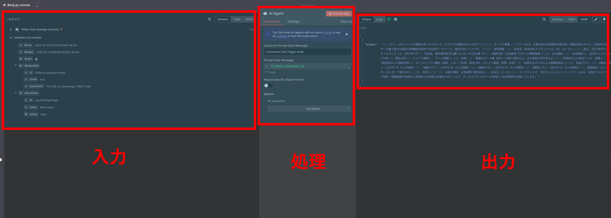
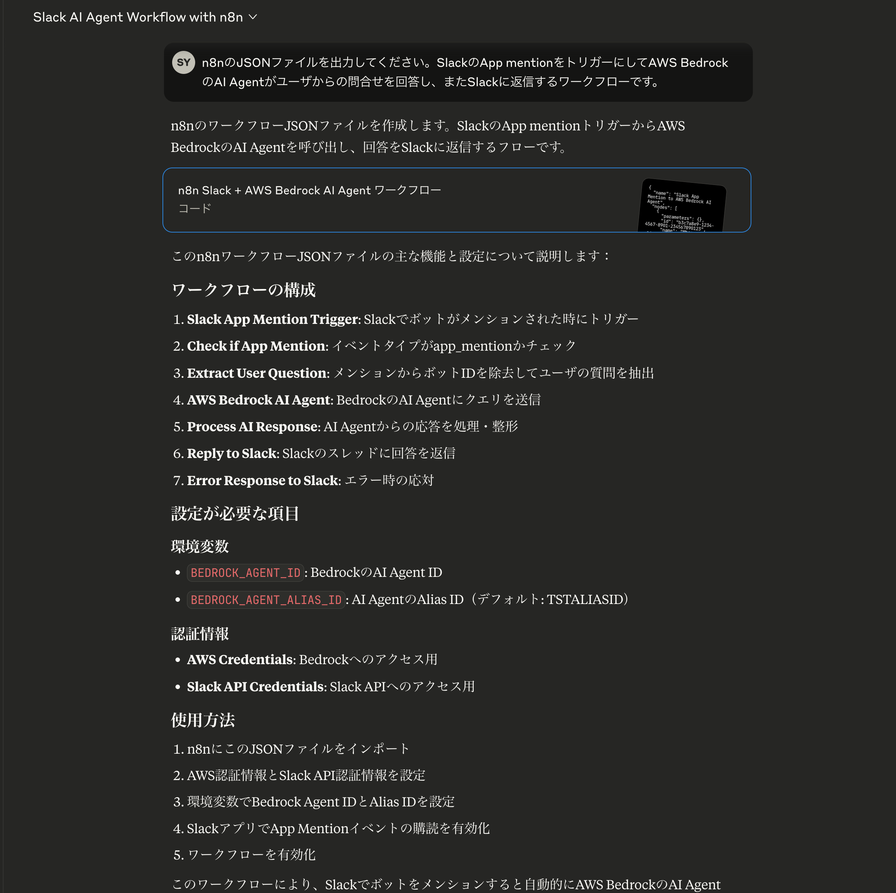
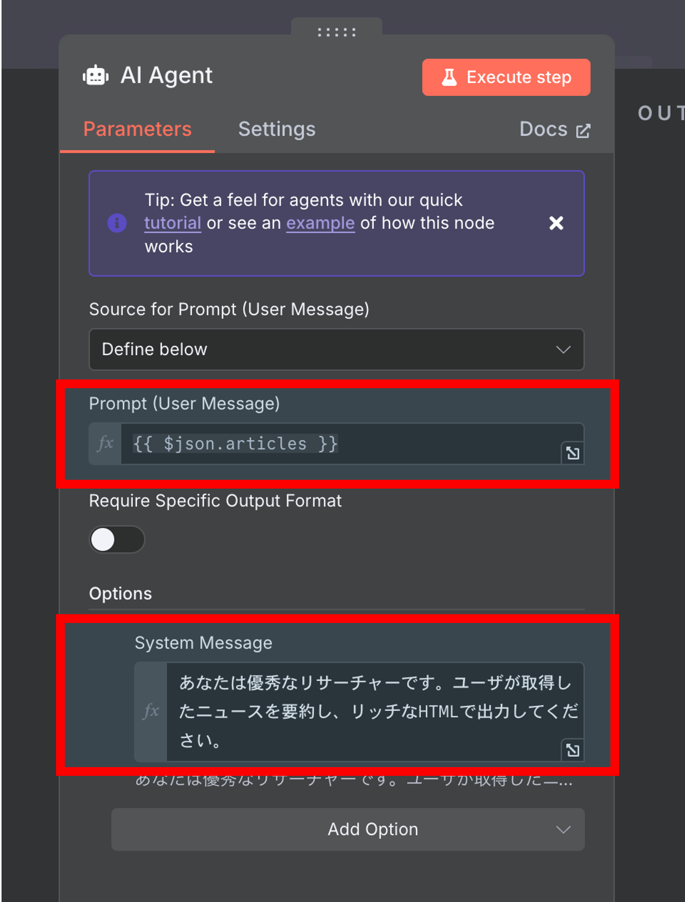
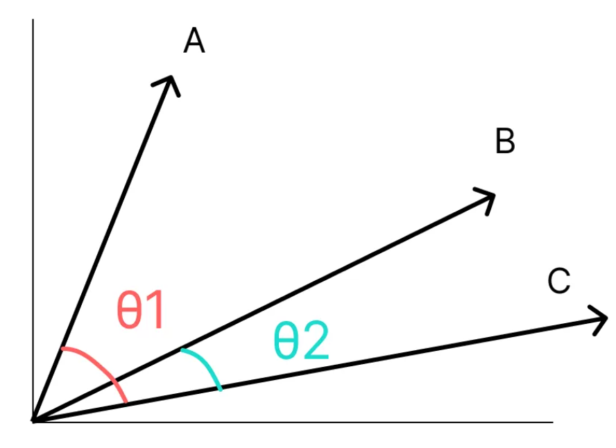
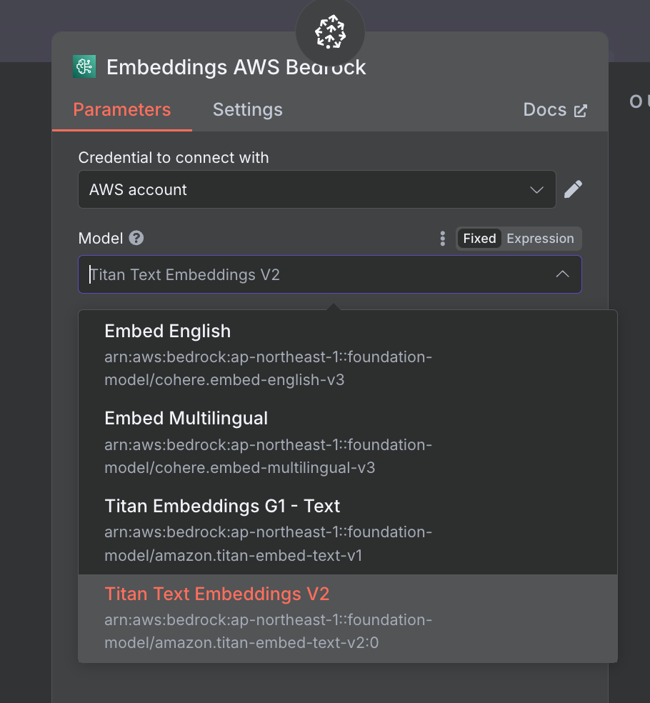
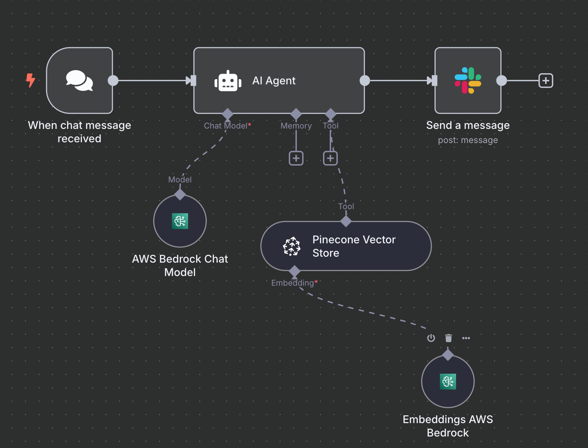
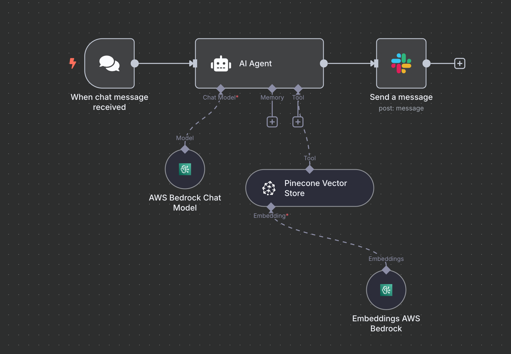

<!-- タイトルスライド -->

# <span>n8n 応用編</span>

## AI エージェント開発マスタークラス

<!-- _class: title-slide -->

---

# 目次

## Part 1: ワークフローとクレデンシャル

<div class="card animated">
  <ol>
    <li><strong>基礎知識の確認</strong> - n8nの概要・UI・特徴</li>
    <li><strong>ワークフローの基本</strong> - 作成方法・ノード・実行モード・AI活用</li>
    <li><strong>Credential管理</strong> - 認証情報の安全な管理</li>
    <li><strong>Slack連携の実装</strong> - メッセージ・認証設定・Block Kit</li>
  </ol>
</div>

---

# 目次

## Part 2: データ処理と高度な機能

<div class="card animated">
  <ol start="5">
    <li><strong>プロンプトエンジニアリング</strong> - 効果的なプロンプト設計・System Message活用</li>
    <li><strong>Structured Outputの活用</strong> - JSONスキーマ・バリデーション</li>
    <li><strong>PineconeによるRAGシステム</strong> - ベクトル検索・LLM連携・Text Embeddings</li>
    <li><strong>実習・演習</strong> - ハンズオン形式での実践演習</li>
  </ol>
</div>

---

# 1. 基礎知識の確認

## 1.1 n8n とは何か（簡単な復習）

<div>
  <h3>🔧 n8nの基本概念</h3>
  
  <div class="grid-2">
    <div>
      <h4>n8nとは</h4>
      <ul>
        <li>Node-based automation tool</li>
        <li>視覚的なワークフロー作成</li>
        <li>400+ のサービス連携</li>
        <li>オープンソース</li>
        <li>セルフホスト可能</li>
      </ul>
    </div>
    <div>
      <h4>主要な用途</h4>
      <ul>
        <li><strong>API連携</strong> - サービス間のデータ転送</li>
        <li><strong>データ処理</strong> - 変換・集計・分析</li>
        <li><strong>通知システム</strong> - アラート・レポート</li>
        <li><strong>業務自動化</strong> - 反復作業の自動化</li>
        <li><strong>AIエージェント作成</strong> - 業務のAI化</li>
      </ul>
    </div>
  </div>
</div>

---

## 1.2 UI 概要とナビゲーション

<div>
  <h3>🖥️ n8n UI の構成</h3>
  
  <div class="grid-2">
    <div>
      <h4>メイン画面の要素</h4>
      <ul>
        <li><strong>左サイドバー</strong>
          <ul>
            <li>ワークフロー一覧</li>
            <li>Credentials</li>
            <li>Executions</li>
            <li>Settings</li>
          </ul>
        </li>
        <li><strong>中央エリア</strong>
          <ul>
            <li>キャンバス（ワークフロー編集）</li>
            <li>ノード配置・接続</li>
          </ul>
        </li>
      </ul>
    </div>
    <div>
      <h4>右パネルの機能</h4>
      <ul>
        <li><strong>ノード設定</strong>
          <ul>
            <li>パラメータ設定</li>
            <li>認証情報選択</li>
            <li>テスト実行</li>
          </ul>
        </li>
        <li><strong>データビューア</strong>
          <ul>
            <li>入力データ確認</li>
            <li>出力データ確認</li>
            <li>JSON表示</li>
          </ul>
        </li>
      </ul>
    </div>
  </div>
</div>

---

<div>
  <h3>🎛️ 重要なナビゲーション機能</h3>
  
  <div class="grid-2">
    <div>
      <h4>キーボードショートカット</h4>
      <div class="code-example" style="font-size: 0.8em;">
Command + S     # 保存<br>
Command + Z     # 元に戻す<br>
Delete       # ノード削除<br>
Command + A     # 全選択<br>
Command + C/V   # コピー&ペースト<br>
Space + カーソル移動       # 画面スクロース<br>
Tab          # ノード検索<br>
      </div>
    </div>
    <div>
      <h4>便利な機能</h4>
      <ul>
        <li><strong>ズーム機能</strong> - command + マウスホイール</li>
        <li><strong>選択範囲</strong> - ドラッグ</li>
        <li><strong>接続線</strong> - ドラッグで接続</li>
        <li><strong>ノードメニュー</strong> - Ctrl + クリック</li>
        <li><strong>整列機能</strong> - option + shift + T</li>
      </ul>
    </div>
  </div>
</div>

---

<div>
  <h3>💡 効率的な作業のコツ</h3>
  
  <div class="grid-3">
    <div>
      <h4 style="color: var(--rp-iris);">🔍 検索活用</h4>
      <ul style="font-size: 0.9em;">
        <li>Tabキーでノード検索</li>
        <li>カテゴリ別フィルタ</li>
        <li>テンプレート活用</li>
      </ul>
    </div>
    <div>
      <h4 style="color: var(--rp-foam);">📋 整理整頓</h4>
      <ul style="font-size: 0.9em;">
        <li>ノードに分かりやすい名前</li>
        <li>Sticky Noteでコメント</li>
        <li>グループ化で見やすく</li>
        <li>一貫したレイアウト</li>
      </ul>
    </div>
    <div>
      <h4 style="color: var(--rp-gold);">🔄 効率化</h4>
      <ul style="font-size: 0.9em;">
        <li>テンプレート保存</li>
        <li>よく使う設定を複製</li>
        <li>実行履歴を活用</li>
        <li>エラーログを確認</li>
      </ul>
    </div>
  </div>
</div>

---

# 2. ワークフローの基本

## 2.1 ワークフローの作成方法

<div>
  
  <div class="grid-2">
    <div>
      <h4>作成手順</h4>
      <ol>
        <li><strong>新規ワークフロー作成</strong> - "New Workflow"</li>
        <li><strong>トリガーノード追加</strong> - 開始点の設定</li>
        <li><strong>アクションノード追加</strong> - 処理内容の定義</li>
        <li><strong>ノード接続</strong> - データフローの構築</li>
        <li><strong>設定とテスト</strong> - パラメータ設定と動作確認</li>
        <li><strong>保存とアクティブ化</strong> - 本番運用開始</li>
      </ol>
    </div>
    <div>
      <h4>ワークフロー設計のポイント</h4>
      <ul>
        <li><strong>目的の明確化</strong> - 何を自動化するか</li>
        <li><strong>データフローの設計</strong> - 入力から出力まで</li>
        <li><strong>エラーハンドリング</strong> - 失敗時の対応</li>
        <li><strong>テスト戦略</strong> - 段階的な検証</li>
        <li><strong>ドキュメント化</strong> - 後で理解できるように</li>
      </ul>
    </div>
  </div>
</div>

---

## 2.2 ノードの種類と役割

<div>  
  <div class="grid-3">
    <div>
      <h4 style="color: var(--rp-iris);">🚀 トリガーノード</h4>
      <ul style="font-size: 0.9em;">
        <li><strong>Manual Trigger</strong> - 手動実行</li>
        <li><strong>Webhook</strong> - HTTP リクエスト受信</li>
        <li><strong>Schedule Trigger</strong> - 時間ベース実行</li>
        <li><strong>Email Trigger</strong> - メール受信</li>
        <li><strong>File Trigger</strong> - ファイル変更監視</li>
      </ul>
    </div>
    <div>
      <h4 style="color: var(--rp-foam);">⚡ アクションノード</h4>
      <ul style="font-size: 0.9em;">
        <li><strong>HTTP Request</strong> - API呼び出し</li>
        <li><strong>Email</strong> - メール送信</li>
        <li><strong>Slack</strong> - Slack操作</li>
        <li><strong>Google Sheets</strong> - スプレッドシート操作</li>
        <li><strong>AI Agent</strong> - AIによる処理</li>
      </ul>
    </div>
    <div>
      <h4 style="color: var(--rp-gold);">🔧 処理ノード</h4>
      <ul style="font-size: 0.9em;">
        <li><strong>Set</strong> - データ設定・変換</li>
        <li><strong>Code</strong> - JavaScript実行</li>
        <li><strong>IF</strong> - 条件分岐</li>
        <li><strong>Switch</strong> - 多分岐</li>
        <li><strong>Loop</strong> - 繰り返し処理</li>
      </ul>
    </div>
  </div>
</div>

---

<div>
  <h3>🎯 よく使用されるノード詳細</h3>
  
  <div style="display: flex; justify-content: center; margin: 20px 0;">
    <div style="overflow-x: auto; max-width: 100%;">
      <table style="width: 100%;">
        <thead>
          <tr>
            <th>ノード名</th>
            <th>主な用途</th>
            <th>設定のポイント</th>
            <th>使用例</th>
          </tr>
        </thead>
        <tbody>
          <tr>
            <td><strong>Manual Trigger</strong></td>
            <td>手動実行・テスト</td>
            <td>シンプルな設定</td>
            <td>開発・デバッグ時</td>
          </tr>
          <tr>
            <td><strong>HTTP Request</strong></td>
            <td>API呼び出し</td>
            <td>URL・メソッド・認証</td>
            <td>外部サービス連携</td>
          </tr>
          <tr>
            <td><strong>AI Agent</strong></td>
            <td>AIエージェント機能の提供</td>
            <td>プロンプトエンジニアリング</td>
            <td>AIエージェント/AIワークフロー</td>
          </tr>
          <tr>
            <td><strong>IF</strong></td>
            <td>条件分岐</td>
            <td>条件式の設定</td>
            <td>データによる処理切り替え</td>
          </tr>
          <tr>
            <td><strong>Code</strong></td>
            <td>複雑な処理</td>
            <td>JavaScript記述</td>
            <td>カスタムロジック実装</td>
          </tr>
        </tbody>
      </table>
    </div>
  </div>
</div>

---

## 2.3 関数とノードの関連性

<div >
  <h3>🔧 関数の基本構造：入力 → 処理 → 出力</h3>
  
  <div class="grid-2">
    <div>
      <h4>関数の3つの要素</h4>
      <div style="margin-bottom: 1.5em;">
        <div style="padding: 0.8em; background: var(--rp-iris-alpha); border-radius: 6px; margin-bottom: 0.8em;">
          <h5 style="color: var(--rp-iris); margin: 0 0 0.3em 0;">📥 入力 (Input)</h5>
          <p style="margin: 0; font-size: 0.9em;">関数のパラメータとして受け取るデータ</p>
        </div>
        <div style="padding: 0.8em; background: var(--rp-foam-alpha); border-radius: 6px; margin-bottom: 0.8em;">
          <h5 style="color: var(--rp-foam); margin: 0 0 0.3em 0;">⚙️ 処理 (Processing)</h5>
          <p style="margin: 0; font-size: 0.9em;">入力データを変換・計算する処理</p>
        </div>
        <div style="padding: 0.8em; background: var(--rp-gold-alpha); border-radius: 6px;">
          <h5 style="color: var(--rp-gold); margin: 0 0 0.3em 0;">📤 出力 (Output)</h5>
          <p style="margin: 0; font-size: 0.9em;">処理結果を返却するデータ</p>
        </div>
      </div>
    </div>
    <div>
      <div class="code-example" style="font-size: 1.00em;">
function calculateDiscount(price, rate) {<br>
  // 📥 入力: price（価格）, rate（割引率）<br> 
  // ⚙️ 処理: 割引計算<br>
  const discountAmount = price * (rate / 100);<br>
  const finalPrice = price - discountAmount;<br>
  // 📤 出力: 計算結果を返却<br>
  return finalPrice;
}
</div>

---

<div>
  <h2>🔗 ノードと関数の関連性</h3>
  <h3>n8nのノードも関数と同じように入力、処理、出力を行う</h2>
  
  <div style="text-align: center; margin-bottom: 2em;">
    
  </div>

</div>

---

## 2.4 実行モード（Manual、Trigger、Webhook）

<div>
  <h3>🔄 実行モードの種類</h3>
  
  <div class="grid-3">
    <div>
      <h4 style="color: var(--rp-iris);">🖱️ Manual（手動）</h4>
      <ul style="font-size: 0.9em;">
        <li>開発・テスト時に使用</li>
        <li>即座に実行される</li>
        <li>デバッグに最適</li>
        <li>Manual Triggerノード使用</li>
      </ul>
      <div class="highlight-box" style="font-size: 0.8em;">
        <strong>使用場面</strong>: ワークフロー開発・動作確認・一回限りの処理
      </div>
    </div>
    <div>
      <h4 style="color: var(--rp-foam);">⏰ Trigger（定期実行）</h4>
      <ul style="font-size: 0.9em;">
        <li>スケジュールに基づく実行</li>
        <li>Cron式での設定</li>
        <li>定期的なデータ処理</li>
        <li>Schedule Triggerノード使用</li>
      </ul>
      <div class="highlight-box" style="font-size: 0.8em;">
        <strong>使用場面</strong>: 日次レポート・データ同期・ヘルスチェック
      </div>
    </div>
    <div>
      <h4 style="color: var(--rp-gold);">🔗 Webhook（イベント駆動）</h4>
      <ul style="font-size: 0.9em;">
        <li>外部からのHTTP リクエスト</li>
        <li>リアルタイム処理</li>
        <li>イベント駆動型</li>
        <li>Webhookノード使用</li>
      </ul>
      <div class="highlight-box" style="font-size: 0.8em;">
        <strong>使用場面</strong>: フォーム送信処理・API連携・通知システム
      </div>
    </div>
  </div>
</div>

---

## 2.5 デバッグとテストの方法

<div>
  <h3>🐛 効果的なデバッグ手法</h3>
  
  <div class="grid-2">
    <div>
      <h4>デバッグの基本手順</h4>
      <ol>
        <li><strong>単体テスト</strong> - 各ノードを個別にテスト</li>
        <li><strong>データ確認</strong> - 各段階でのデータ状態確認</li>
        <li><strong>エラーログ確認</strong> - 詳細なエラー情報の分析</li>
        <li><strong>段階的実行</strong> - 部分的にワークフローを実行</li>
        <li><strong>本番テスト</strong> - 実環境での動作確認</li>
      </ol>
    </div>
    <div>
      <h4>デバッグツールの活用</h4>
      <ul>
        <li><strong>Execute Node</strong> - 単一ノードの実行</li>
        <li><strong>Pin Data</strong> - テストデータの固定</li>
        <li><strong>Execution Log</strong> - 実行履歴の確認</li>
        <li><strong>JSON Viewer</strong> - データ構造の視覚化</li>
        <li><strong>Error Information</strong> - エラーの詳細情報</li>
      </ul>
    </div>
  </div>
</div>

---

## 2.6 ワークフローのエクスポート・インポート

<div>
  <h3>📤 ワークフローのエクスポート</h3>
  
  <div class="grid-2">
    <div>
      <h4>エクスポート機能の概要</h4>
      <ul>
        <li><strong>JSON形式</strong> - ワークフロー全体をJSON形式で保存</li>
        <li><strong>設定の保持</strong> - ノード設定・接続情報も含む</li>
        <li><strong>バージョン管理</strong> - 開発段階の保存</li>
        <li><strong>バックアップ</strong> - 重要なワークフローの保管</li>
      </ul>
    </div>
    <div>
      <h5 style="color: var(--rp-iris); margin-top: 1.5em;">エクスポート手順</h5>
      <ol style="font-size: 0.9em;">
        <li>ワークフロー画面右上の <strong>メニュー</strong> をクリック</li>
        <li><strong>「Export」</strong> を選択</li>
        <li>エクスポート形式を選択（JSON推奨）</li>
        <li>ファイルをダウンロード</li>
      </ol>
  </div>
</div>

---

## 2.7 ワークフローのインポート

<div>
  <h3>📦 ワークフローの共有と管理</h3>
  
  <div class="grid-2">
    <div>
      <h4>インポート機能の概要</h4>
      <ul>
        <li><strong>ワークフロー復元</strong> - 保存したワークフローを読み込み</li>
        <li><strong>チーム共有</strong> - 他の開発者とワークフロー共有</li>
        <li><strong>環境移行</strong> - 開発環境から本番環境への移行</li>
        <li><strong>テンプレート活用</strong> - 既存のワークフローを元に新規作成</li>
      </ul>
      </div>
      <div>
      <h5 style="color: var(--rp-foam); margin-top: 1.5em;">インポート手順</h5>
      <ol style="font-size: 0.9em;">
        <li>ワークフロー一覧画面で <strong>「Import」</strong> をクリック</li>
        <li>JSONファイルを選択またはテキスト貼り付け</li>
        <li>ワークフロー名を設定</li>
        <li><strong>「Import」</strong> で完了</li>
      </ol>
    </div>
  </div>

---

## 2.8 AI を活用したワークフロー作成

<div>
  <h3>🤖 AI でワークフローを自動生成</h3>
  
  <div class="grid-2">
    <div>
      <h4>AI によるワークフロー作成の特徴</h4>
      <ul>
        <li><strong>自然言語での指示</strong> - 日本語で要求を伝えるだけ</li>
        <li><strong>自動ノード配置</strong> - 適切なノードを自動選択・配置</li>
        <li><strong>設定の最適化</strong> - ベストプラクティスに基づく設定</li>
        <li><strong>時間短縮</strong> - 手動作業を大幅に削減</li>
        <li><strong>学習効果</strong> - 生成されたワークフローから学習可能</li>
      </ul>
              <p style="font-size: 0.8em;">例 : n8nのJSONファイルを出力してください。SlackのApp mentionをトリガーにしてAWS BedrockのAI Agentがユーザからの問合せを回答し、またSlackに返信するワークフローです。</p>
    </div>
    <div>
      
    </div>
  </div>
</div>

---

# 3. Credential（認証情報）の管理

## 3.1 Credential とは何か

<div>
  <h3>🔐 Credentialの基本概念</h3>
  
  <div class="grid-2">
    <div>
      <h4>Credentialとは</h4>
      <ul>
        <li><strong>認証情報の集約管理</strong> - API キー、トークン、パスワード</li>
        <li><strong>セキュアな保存</strong> - 暗号化されて保管</li>
        <li><strong>再利用可能</strong> - 複数のワークフローで共有</li>
        <li><strong>権限管理</strong> - ユーザーごとのアクセス制御</li>
      </ul>
    </div>
    <div>
      <h4>なぜCredentialが重要なのか</h4>
      <ul>
        <li><strong>セキュリティ</strong> - 機密情報の安全な管理</li>
        <li><strong>効率性</strong> - 一度設定すれば再利用可能</li>
        <li><strong>メンテナンス性</strong> - 一箇所で更新すれば全体に反映</li>
        <li><strong>監査性</strong> - アクセス履歴の追跡</li>
      </ul>
    </div>
  </div>
</div>

---

## 3.2 各種サービスの Credential 設定方法

<div>
  <h3>🌐 主要サービスのCredential設定</h3>
  
  <div class="grid-3">
    <div>
      <h4 style="color: var(--rp-iris);">🔑 API Key型</h4>
      <ul style="font-size: 0.9em;">
        <li><strong>OpenAI</strong> - API Key</li>
        <li><strong>Slack</strong> - Bot User OAuth Token</li>
        <li><strong>SendGrid</strong> - API Key</li>
        <li><strong>Pinecone</strong> - API Key</li>
      </ul>
      <div class="code-example" style="font-size: 0.7em;">
# 設定例
API Key: sk-xxx...xxx
Environment: production
      </div>
    </div>
    <div>
      <h4 style="color: var(--rp-foam);">🔄 OAuth2型</h4>
      <ul style="font-size: 0.9em;">
        <li><strong>Google Sheets</strong> - OAuth2</li>
        <li><strong>Microsoft 365</strong> - OAuth2</li>
        <li><strong>GitHub</strong> - OAuth2</li>
        <li><strong>Salesforce</strong> - OAuth2</li>
      </ul>
      <div class="code-example" style="font-size: 0.7em;">
# 設定項目
Client ID: your-client-id
Client Secret: your-secret
Scope: read,write
      </div>
    </div>
    <div>
      <h4 style="color: var(--rp-gold);">🔐 Basic認証型</h4>
      <ul style="font-size: 0.9em;">
        <li><strong>HTTP Basic Auth</strong></li>
        <li><strong>Legacy APIs</strong></li>
        <li><strong>Internal Systems</strong></li>
        <li><strong>Database接続</strong></li>
      </ul>
      <div class="code-example" style="font-size: 0.7em;">
# 設定例
Username: admin
Password: secure-password
Host: api.example.com
      </div>
    </div>
  </div>
</div>

---

<div>
  <h3>⚙️ Credential設定の実践手順</h3>
  
  <div class="grid-2">
    <div>
      <h4>設定手順</h4>
      <ol>
        <li><strong>Credentialsメニューを開く</strong></li>
        <li><strong>"Add Credential"をクリック</strong></li>
        <li><strong>サービスタイプを選択</strong></li>  
        <li><strong>必要な情報を入力</strong></li>
        <li><strong>接続テストを実行</strong></li>
        <li><strong>保存して完了</strong></li>
      </ol>
    </div>
    <div>
      <h4>設定時の注意点</h4>
      <ul>
        <li><strong>正確な情報入力</strong> - スペースや改行に注意</li>
        <li><strong>権限スコープ</strong> - 必要最小限の権限設定</li>
        <li><strong>有効期限確認</strong> - トークンの更新時期</li>
        <li><strong>テスト実行</strong> - 設定後は必ず動作確認</li>
        <li><strong>命名規則</strong> - 分かりやすい名前付け</li>
      </ul>
    </div>
  </div>
</div>

---

## 3.3 セキュリティのベストプラクティス

<div class="card animated">
  <h3>🛡️ セキュリティ対策</h3>
  
  <div class="grid-3">
    <div>
      <h4 style="color: var(--rp-iris);">🔒 アクセス制御</h4>
      <ul style="font-size: 0.9em;">
        <li><strong>最小権限の原則</strong></li>
        <li><strong>役割ベースのアクセス</strong></li>
        <li><strong>定期的な権限見直し</strong></li>
        <li><strong>不要な権限の削除</strong></li>
      </ul>
    </div>
    <div>
      <h4 style="color: var(--rp-foam);">🔄 定期メンテナンス</h4>
      <ul style="font-size: 0.9em;">
        <li><strong>定期的なローテーション</strong></li>
        <li><strong>有効期限の管理</strong></li>
        <li><strong>未使用認証情報の削除</strong></li>
        <li><strong>セキュリティログの監視</strong></li>
      </ul>
    </div>
    <div>
      <h4 style="color: var(--rp-gold);">📊 監査とモニタリング</h4>
      <ul style="font-size: 0.9em;">
        <li><strong>アクセスログの記録</strong></li>
        <li><strong>異常検知アラート</strong></li>
        <li><strong>使用状況の監視</strong></li>
        <li><strong>コンプライアンス確認</strong></li>
      </ul>
    </div>
  </div>
</div>

---

# 4. Slack 連携の実装

## 4.1 Slack Credential の設定

<div>
  
  <div class="grid-2">
    <div>
      <h4>Slack App作成手順</h4>
      <ol>
        <li><strong>api.slack.com</strong> にアクセス</li>
        <li><strong>"Create New App"</strong> をクリック</li>
        <li><strong>"From scratch"</strong> を選択</li>
        <li><strong>アプリ名とワークスペース</strong> を設定</li>
        <li><strong>"OAuth & Permissions"</strong> で権限設定</li>
        <li><strong>"Install to Workspace"</strong> を実行</li>
        <li><strong>Bot User OAuth Token</strong> をコピー</li>
      </ol>
    </div>
    <div>
      <h4>必要な権限（Scopes）</h4>
      <ul>
        <li><strong>chat:write</strong> - メッセージ送信</li>
        <li><strong>chat:write.public</strong> - パブリックチャンネル投稿</li>
        <li><strong>channels:read</strong> - チャンネル情報取得</li>
        <li><strong>users:read</strong> - ユーザー情報取得</li>
        <li><strong>files:write</strong> - ファイルアップロード</li>
        <li><strong>files:read</strong> - ファイル読み取り</li>
      </ul>
    </div>
  </div>
</div>

---

## 4.2 メッセージ送信の基本

<div>
  <h3>💬 Slackメッセージ送信の実装</h3>
  
  <div class="grid-2">
    <div>
      <h4>基本的なメッセージ送信</h4>
      <div class="code-example" style="font-size: 0.8em;">

#### シンプルなテキストメッセージ

{
"channel": "#general",
"text": "Hello from n8n!"
}

</div>
</div>
<div>
<h4>高度なメッセージ機能</h4>
<ul>
<li><strong>Markdown 記法</strong> - _太字_、_斜体_、`コード`</li>
<li><strong>メンション</strong> - @user、@channel</li>
<li><strong>チャンネルリンク</strong> - #channel-name</li>
<li><strong>絵文字</strong> - :smile:、:warning:</li>
<li><strong>URL</strong> - 自動リンク化</li>
<li><strong>コードブロック</strong> - ```でコード整形</li>
</ul>
</div>

  </div>
</div>

---

<div>
  <h3>🎨 Block Kit を使用したリッチメッセージ</h3>
  <div style="margin-bottom: 1em;">
    <p><strong>参考リンク:</strong></p>
    <ul>
      <li><a href="https://api.slack.com/block-kit" target="_blank">Block Kit - Slack API Documentation</a></li>
      <li><a href="https://app.slack.com/block-kit-builder" target="_blank">Block Kit Builder - Interactive Tool</a></li>
    </ul>
  </div>
  
  <div class="grid-2">
    <div>
      <h4>Block Kit の主要要素</h4>
      <ul>
        <li><strong>Section</strong> - テキストと画像の表示</li>
        <li><strong>Divider</strong> - 区切り線</li>
        <li><strong>Actions</strong> - ボタンやメニュー</li>
        <li><strong>Context</strong> - 補足情報</li>
        <li><strong>Header</strong> - 見出し</li>
        <li><strong>Image</strong> - 画像表示</li>
      </ul>
    </div>
    <div>
      <h4>実装例</h4>
      <div class="code-example" style="font-size: 0.7em;">
{
  "blocks": [
    {
      "type": "header",
      "text": {
        "type": "plain_text",
        "text": "🚨 System Alert"
      }
    },
    {
      "type": "section",
      "text": {
        "type": "mrkdwn",
        "text": "*Status:* Critical\n*Time:* {{ $now }}"
      }
    },
    {
      "type": "actions",
      "elements": [
        {
          "type": "button",
          "text": {
            "type": "plain_text",
            "text": "Acknowledge"
          },
          "value": "ack",
          "action_id": "acknowledge"
        }
      ]
    }
  ]
}
      </div>
    </div>
  </div>
</div>

---

# 5 プロンプトエンジニアリング

## 5.1 プロンプトエンジニアリングの基礎

<div>
  <h3>🎯 プロンプトエンジニアリングとは</h3>
  
  <div class="grid-2">
    <div>
      <h4>プロンプトエンジニアリングの重要性</h4>
      <ul>
        <li><strong>精度向上</strong> - より正確な結果を得る</li>
        <li><strong>一貫性確保</strong> - 安定した出力品質</li>
        <li><strong>効率化</strong> - 試行錯誤の時間短縮</li>
        <li><strong>コスト削減</strong> - APIコールの最適化</li>
        <li><strong>ユーザビリティ</strong> - より使いやすいAI活用</li>
      </ul>
    </div>
    <div>
      <h4>n8nでの適用場面</h4>
      <ul>
        <li><strong>的確な出力</strong> - 出力形式を指定</li>
        <li><strong>データ変換</strong> - 自然言語での指示</li>
        <li><strong>コンテンツ生成</strong> - 品質の高い文章作成</li>
        <li><strong>分析・要約</strong> - 構造化された分析結果</li>
      </ul>
    </div>
  </div>
</div>

---

## 5.2 プロンプト設計

<div>
  <h3>📝 効果的なプロンプト設計のテクニック</h3>
  
  <div>
    <h4>基本原則</h4>
    <div class="grid-3">
      <div>
        <h5 style="color: var(--rp-iris);">🎯 明確性</h5>
        <ul style="font-size: 0.9em;">
          <li>具体的な指示</li>
          <li>曖昧な表現を避ける</li>
          <li>期待する結果を明示</li>
          <li>制約条件の明記</li>
        </ul>
      </div>
      <div>
        <h5 style="color: var(--rp-foam);">🏗️ 構造化</h5>
        <ul style="font-size: 0.9em;">
          <li>段階的な指示</li>
          <li>論理的な順序</li>
          <li>セクション分け</li>
          <li>例示の活用</li>
        </ul>
      </div>
      <div>
        <h5 style="color: var(--rp-gold);">🎭 役割定義</h5>
        <ul style="font-size: 0.9em;">
          <li>AIの役割を明確化</li>
          <li>専門性の設定</li>
          <li>口調・スタイル指定</li>
          <li>制限事項の設定</li>
        </ul>
      </div>
    </div>
  </div>

---

<div>
  <h3>🛠️ 実践的なプロンプト最適化手法</h3>
  
  <div class="grid-2">
    <div>
      <h4>Chain of Thought :CoT（思考の連鎖）</h4>
      <div class="code-example" style="font-size: 0.7em;">
以下の手順で問題を解決してください：<br><br>
1. 問題の理解<br>
   - 与えられた情報を整理<br>
   - 解決すべき課題を明確化<br><br>
2. 分析の実行<br>
   - データパターンの特定<br>
   - 関連性の調査<br><br>
3. 結論の導出<br>
   - 論理的推論に基づく結論<br>
   - 信頼度の評価<br>
<br>
各ステップの思考過程を明示してください。

</div>
</div>
<div>
<h4> Few-shot prompting</h4>
<div class="code-example" style="font-size: 0.7em;">
以下の例を参考に、同様の分析を行ってください：<br><br>
例 1:<br>
入力: {"売上": 100000, "前年比": 1.2}<br>
出力: {"評価": "好調", "理由": "前年比 20%増"}<br>
<br>
例 2:<br>
入力: {"売上": 80000, "前年比": 0.9}<br>
出力: {"評価": "課題あり", "理由": "前年比 10%減"}<br>
<br>
分析対象:<br>
{{ $json.sales_data }}

</div>

---

## 5.4 User Prompt と System Message の役割

<div>
  <h3>💬 プロンプトの構成要素</h3>
  
  <div class="grid-2">
    <div>
      
    </div>
    <div>
      <h4>System Message の役割</h4>
      <ul>
        <li><strong>AIの性格・役割定義</strong> - AIがどのような専門家として振る舞うか</li>
        <li><strong>制約条件の設定</strong> - 回答の範囲や禁止事項</li>
        <li><strong>出力形式の指定</strong> - JSONや特定フォーマット指定</li>
      </ul>
      <h4>User Prompt の役割</h4>
      <ul>
        <li><strong>具体的な質問・要求</strong> - ユーザーが求める情報</li>
        <li><strong>コンテキスト提供</strong> - 背景情報や状況説明</li>
        <li><strong>入力データ</strong> - 処理対象となるデータ</li>
        <li><strong>期待する出力</strong> - 求める結果の明確化</li>
      </ul>
    </div>
  </div>
</div>

---

# 6. Structured Output の活用

## 6.1 Structured Output とは

<div>
  <h3>🏗️ Structured Output の概念</h3>
  
  <div class="grid-2">
    <div>
      <h4>Structured Output の特徴</h4>
      <ul>
        <li><strong>構造化されたデータ出力</strong> - 予測可能な形式</li>
        <li><strong>スキーマ定義</strong> - データ構造の事前定義</li>
        <li><strong>バリデーション</strong> - データ整合性の確保</li>
        <li><strong>型安全性</strong> - データ型の保証</li>
        <li><strong>一貫性</strong> - 出力形式の統一</li>
      </ul>
    </div>
    <div>
      <h4>活用場面</h4>
      <ul>
        <li><strong>API レスポンス</strong> - 一貫したデータ形式</li>
        <li><strong>データ変換</strong> - 標準化された変換</li>
        <li><strong>レポート生成</strong> - 定型レポート作成</li>
        <li><strong>システム連携</strong> - データ交換の標準化</li>
        <li><strong>エラーハンドリング</strong> - 予測可能なエラー情報</li>
      </ul>
    </div>
  </div>
</div>

---

## 6.2 JSON スキーマの定義

<div>
  <h3>📋 JSON スキーマの作成</h3>
  
  <div class="grid-2">
    <div>
      <h4>基本的なスキーマ構造</h4>
      <div class="code-example" style="font-size: 0.7em;">
{
  "$schema": "http://json-schema.org/draft-07/schema#",
  "type": "object",
  "required": ["id", "name", "email"],
  "properties": {
    "id": {
      "type": "integer",
      "minimum": 1
    },
    "name": {
      "type": "string",
      "minLength": 1,
      "maxLength": 100
    },
    "email": {
      "type": "string",
      "format": "email"
    },
    "age": {
      "type": "integer",
      "minimum": 0,
      "maximum": 150
    }
  }
}
      </div>
    </div>
    <div>
      <h4>複雑なスキーマ例</h4>
      <div class="code-example" style="font-size: 0.7em;">
{
  "type": "object",
  "properties": {
    "user": {
      "type": "object",
      "properties": {
        "profile": { "$ref": "#/definitions/Profile" },
        "preferences": {
          "type": "array",
          "items": { "type": "string" }
        }
      }
    }
  },
  "definitions": {
    "Profile": {
      "type": "object",
      "properties": {
        "firstName": { "type": "string" },
        "lastName": { "type": "string" },
        "birthDate": { "type": "string", "format": "date" }
      }
    }
  }
}
      </div>
    </div>
  </div>
</div>

---

# 7. Pinecone による RAG システム

## 7.1 RAG とは

<div>
  <h3>🧠 RAG (Retrieval-Augmented Generation) の概要</h3>
  
  <div class="grid-2">
    <div>
      <h4>RAG とは何か</h4>
      <ul>
        <li><strong>検索拡張生成</strong> - Retrieval-Augmented Generation</li>
        <li><strong>外部知識の活用</strong> - LLMの知識を補完</li>
        <li><strong>リアルタイム情報</strong> - 最新データの活用</li>
        <li><strong>幻覚の抑制</strong> - 根拠のある回答生成</li>
        <li><strong>専門知識対応</strong> - 特定分野の詳細情報</li>
      </ul>
    </div>
    <div>
      <h4>RAG システムの仕組み</h4>
      <ul>
        <li><strong>Step 1</strong> - ユーザーの質問を受信</li>
        <li><strong>Step 2</strong> - 関連文書をベクトル検索</li>
        <li><strong>Step 3</strong> - 検索結果をコンテキストとして追加</li>
        <li><strong>Step 4</strong> - LLMが拡張された情報で回答生成</li>
        <li><strong>Step 5</strong> - 根拠と共に回答を返却</li>
      </ul>
    </div>
  </div>

---

## 7.2 ベクトル検索とコサイン類似度

<div>
  <h3>🔍 ベクトル検索の仕組み</h3>
  
  <div class="grid-2">
    <div>
      
    </div>
    <div>
      <h4>ベクトル検索とは</h4>
      <ul>
        <li><strong>数値ベクトル化</strong> - テキストを高次元数値に変換</li>
        <li><strong>意味的類似性</strong> - 文字列ではなく意味で検索</li>
        <li><strong>エンベディング</strong> - AIモデルによる特徴量抽出</li>
        <li><strong>高速検索</strong> - 近似最近傍探索アルゴリズム</li>
      </ul>
      <h4>コサイン類似度</h4>
      <ul>
        <li><strong>角度による類似性</strong> - ベクトル間の角度を測定</li>
        <li><strong>-1から1の値</strong> - 1に近いほど類似</li>
        <li><strong>長さに非依存</strong> - 文書の長さに影響されない</li>
      </ul>
  </div>
</div>

---

## 7.3 RAG の利点

  <div style="margin-top: 1.5em;">
    <h3>RAGの活用</h4>
    <div class="grid-3">
      <div>
        <h5 style="color: var(--rp-iris);">🎯 精度向上</h5>
        <ul style="font-size: 0.9em;">
          <li>事実に基づく回答</li>
          <li>幻覚の大幅な削減</li>
          <li>情報の信頼性向上</li>
        </ul>
      </div>
      <div>
        <h5 style="color: var(--rp-foam);">⚡ 効率性</h5>
        <ul style="font-size: 0.9em;">
          <li>コスト効率的な運用</li>
          <li>高速な情報取得</li>
          <li>スケーラブルな設計</li>
        </ul>
      </div>
      <div>
        <h5 style="color: var(--rp-gold);">🔄 柔軟性</h5>
        <ul style="font-size: 0.9em;">
          <li>知識ベースの更新容易</li>
          <li>多様なデータソース対応</li>
          <li>カスタマイズ可能</li>
        </ul>
      </div>
    </div>
  </div>
</div>

---

## 7.4 Pinecone とは

<div>
  <h3>🌲 Pinecone ベクトルデータベースの概要</h3>
  
  <div class="grid-2">
    <div>
      <h4>Pinecone の特徴</h4>
      <ul>
        <li><strong>ベクトル検索</strong> - 高速な類似性検索</li>
        <li><strong>スケーラビリティ</strong> - 大規模データ対応</li>
        <li><strong>マネージドサービス</strong> - インフラ管理不要</li>
        <li><strong>高精度</strong> - 意味的類似性の検索</li>
        <li><strong>リアルタイム</strong> - 即座のインデックス更新</li>
      </ul>
    </div>
    <div>
      <h4>RAG システムでの役割</h4>
      <ul>
        <li><strong>知識ベース</strong> - 文書の埋め込み保存</li>
        <li><strong>文脈検索</strong> - 関連情報の取得</li>
        <li><strong>情報拡張</strong> - LLM への追加情報提供</li>
        <li><strong>精度向上</strong> - 回答の根拠となる情報</li>
        <li><strong>コスト削減</strong> - 効率的な情報取得</li>
      </ul>
    </div>
  </div>
</div>

---

## 7.5 Text Embeddings の実装

<div>
  <h3>📊 Amazon Titan Text Embeddings v2 の活用</h3>
  
  <div class="grid-2">
    <div>
      
    </div>
    <div>
      <h4>Titan Text Embeddings v2 の特徴</h4>
      <ul>
        <li><strong>高次元ベクトル</strong> - 1024次元の密なベクトル表現</li>
        <li><strong>多言語対応</strong> - 100以上の言語をサポート</li>
        <li><strong>スケーラブル</strong> - 大量テキストの効率的処理</li>
        <li><strong>コスト効率</strong> - 従量課金制で経済的</li>
      </ul>
      <h4>RAG システムでの活用</h4>
      <ul>
        <li><strong>文書の埋め込み</strong> - テキストをベクトル化</li>
        <li><strong>クエリの埋め込み</strong> - 検索クエリをベクトル化</li>
        <li><strong>類似性計算</strong> - コサイン類似度による検索</li>
      </ul>
    </div>
  </div>
</div>

---

<div>
  <h3>🔍 RAG システムでのベクトル検索実装</h3>
  
  <div class="grid-2">
    <div>
      <h4>検索時の埋め込み処理</h4>
      <ul>
        <li><strong>クエリの埋め込み</strong> - ユーザーの質問をベクトル化</li>
        <li><strong>同一モデル使用</strong> - <strong>保存時と同じTitan Text Embeddings v2を使用してください</strong></li>
        <li><strong>ベクトル次元統一</strong> - 1024次元での一貫性</li>
      </ul>
      <h4>Pinecone での検索プロセス</h4>
      <ul>
        <li><strong>類似度検索</strong> - コサイン類似度による計算</li>
        <li><strong>スコアベース抽出</strong> - 関連度の高い文書を選択</li>
        <li><strong>結果ランキング</strong> - 関連度順での結果取得</li>
      </ul>
    </div>
    <div>
      
    </div>
  </div>
</div>

---

## 7.5 LLM との連携

<div>
  <h3>🤖 LLM と RAG の統合</h3>
  
  <div class="grid-2">
    <div>
      
    </div>
    <div>
      <h4>AI Agent での RAG Tool 活用</h4>
      <ul>
        <li><strong>Tool としての RAG</strong> - AI Agent が必要に応じて知識ベースを検索</li>
        <li><strong>動的な情報取得</strong> - ユーザーの質問に応じて関連文書を自動検索</li>
        <li><strong>文脈に基づく回答</strong> - 検索結果を基にした正確な応答生成</li>
        <li><strong>知識の拡張</strong> - 事前学習データを超えた最新情報の活用</li>
      </ul>
      
  </div>
</div>

---

# 8. 実習・演習

## 8.1 ハンズオン演習

<div>
  
  <div class="grid-2">
    <div>
      <h4>基本演習</h4>
      <ul>
        <li><strong>AIエージェントにおけるTool利用</strong>
          <ul>
            <li>AIエージェントの作成</li>
            <li>Serp APIの登録と設定</li>
          </ul>
        </li>
      </ul>
    </div>
    <div>
      <h4>応用演習</h4>
      <ul>
        <li><strong>Structured Output Parserの設定</strong>
          <ul>
            <li>AIエージェントの作成</li>
            <li>AIエージェントの出力安定化</li>
          </ul>
        </li>
      </ul>
      <ul>
        <li><strong>RAGを用いたAIエージェント作成</strong>
          <ul>
            <li>AIエージェントの作成</li>
            <li>Pineconeへの接続</li>
          </ul>
        </li>
      </ul>
    </div>
  </div>
</div>

---

<div class="card animated">
  <h3>🎉 最終メッセージ</h3>
  
  <div style="text-align: center; padding: 2em;">
    <h2 style="color: var(--rp-iris); margin-bottom: 1em;">おめでとうございます！</h2>
    <p style="font-size: 24px; margin-bottom: 1.5em;">
      皆さんは n8n の基礎から応用まで、包括的な知識とスキルを身につけました。
    </p>
    <p style="font-size: 22px; color: var(--rp-foam);">
      AIエージェントの力で、より創造的で意味のある仕事に集中できるようになることを願っています。
    </p>
    <div style="margin-top: 2em; font-size: 34px;">
      <span style="color: var(--rp-gold);">🚀</span>
      <span style="color: var(--rp-iris); font-weight: bold;">Let's build AI Agents !</span>
      <span style="color: var(--rp-foam);">🤖</span>
    </div>
  </div>
</div>
